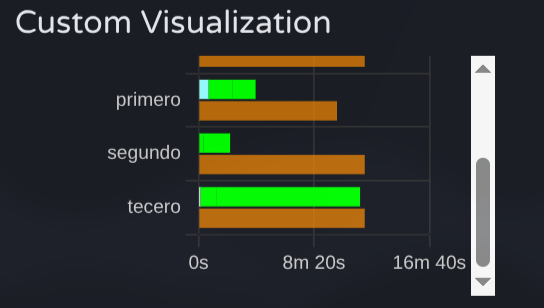
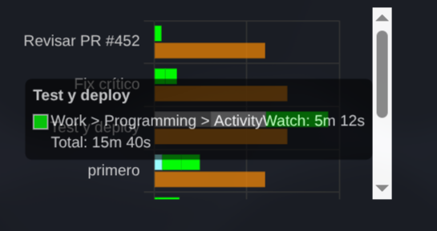
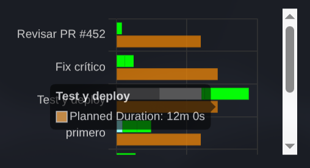

# aw-nextblock

**WIP** CLI tool and [ActivityWatch](https://activitywatch.net) watcher for timeblocking sessions

## Table of Contents

- [What is this](#what-is-this)
- [What it offers](#what-it-offers)
  - [Track Actual vs. Planned activity](#track-actual-vs-planned-activity)
  - [Interactive Session](#interactive-session)
  - [Session Review](#session-review)
- [Why it's useful](#why-its-useful)
- [Getting Started](#getting-started)
  - [CLI Commands](#control-commands)
  - [Triggering Next](#triggering-next)
  - [Setup Custom Visualization](#setup-custom-visualization)
  - [Usage](#usage)
- [Installation Setup](#installation-setup)
  - [Watcher Configuration](#watcher-configuration)
  - [Requirements](#requirements)
- [Project Status](#project-status)
- [Contributing](#contributing)
- [License](#license)
- [Related](#related)

---

## What is this

aw-nextblock reimagines [time blocking](https://en.wikipedia.org/wiki/Timeblocking) by prioritizing realistic flexibility over rigid scheduling by proposing interactive work sessions where your **only** responsibility is decide **when** to advance to the `next` task. this approach gives insightful planned vs real activity data thanks to the [ActivityWatch](https://activitywatch.net) ecosystem.

## What it offers

### Track Actual vs. Planned activity

aw-nextblock leverages automatic activity tracking (thanks [ActivityWatch](https://activitywatch.net) <3) and enrich that information with real work session timeblocks, where each one represents the time you actually spent (planned time is stored as metadata for custom visualization usage).

### Interactive Session

During a work session, the only input needed by you is [`next`](#triggering-next), what is this ? For now is just a CLI command, but this means you can trigger it any way you want, however, i recommend the keybinding approach.

Session feedback is delivered via system notifications at configurable intervals: before, at, and after the planned duration of timeblocks.

### Session Review

A Custom visualization shows your planned blocks alongside actual activity data in a clear parallel-bar chart. See exactly what happened during each block and use these insights to improve your workflow.






## Why it's useful

Traditional time blocking assumes perfect estimates and rigid adherence. Reality is messier, tasks take longer or shorter than expected, flow state matters, interruptions happen.

aw-nextblock provides structure without rigidity. Plans are guides, not rules. You stay aware of time without being controlled by it. The visual analysis of your sessions helps you understand your work patterns and continuously improve your workflow.

## Getting Started

### CLI commands

Use `aw-nextblock` for session management:

```bash
aw-nextblock start <plan.yaml>    # Start a work session
aw-nextblock next                 # Move to next block
aw-nextblock status               # Check current status
aw-nextblock stop                 # Stop current session
```

### Triggering Next

While you can run `aw-nextblock next` from the terminal, the recommended approach is using a keybinding for instant access during your workflow.

Example Hyprland keybinding:
```
bind = $mainMod ALT, N, exec, aw-nextblock next
```


### Usage

#### 1. Define Your Plan

Create a YAML file with your work session:

```yaml
session_name: "Morning Deep Work"

blocks:
  - name: "Architecture Design"
    duration: 45
    
  - name: "Core Implementation"
    duration: 90
    
  - name: "Testing"
    duration: 30
```

Durations are estimates, not limits.

#### 2. Start Your Session

```bash
aw-nextblock start plan.yaml
```

This creates a session file and start its aw watcher process.

#### 3. Work and Advance

Focus on your current task. When ready to move forward:

```bash
aw-nextblock next
```

See [Triggering Next](#triggering-next) for recommended setup.

#### 4. Review Your Session

After completing your work session, use the custom visualization in ActivityWatch's web UI to analyze your planned blocks against actual activity data.

## Installation Setup

### Download Binary

1. Go to the [Releases page](https://github.com/felixzsh/aw-nextblock/releases) on GitHub
2. Download the ZIP file for your operating system:
   - **Linux**: `aw-nextblock-linux.zip`
   - **Windows**: `aw-nextblock-windows.zip`
   - **macOS**: `aw-nextblock-macos.zip`

3. Extract the downloaded ZIP file. You'll get:
   - `aw-nextblock` binary executable
   - `visualization/` folder

### Install Binary

4. Add the `aw-nextblock` binary to your system PATH:
   - **Linux/macOS**: Copy to `/usr/local/bin/` or add to your `$PATH`
   - **Windows**: Add to a directory in your `PATH` environment variable

### Optional: Setup Visualization (Experimental Feature)

The visualization allows you to see your planned vs actual activity data in ActivityWatch's web UI. This is an **experimental feature** that requires manual configuration.

5. Place the `visualization/` folder anywhere on your system (recommended: ActivityWatch config directory)
6. Configure ActivityWatch to serve the visualization by adding this to your `aw-server.toml` config file:

**Linux** (`~/.config/activitywatch/aw-server/aw-server.toml`):
```toml
[server.custom_static]
aw-watcher-nextblock = "/path/to/your/visualization/folder/"
```

**Windows** (`%APPDATA%\activitywatch\aw-server\aw-server.toml`):
```toml
[server.custom_static]
aw-watcher-nextblock = "C:\\path\\to\\your\\visualization\\folder\\"
```

**macOS** (`~/Library/Application Support/activitywatch/aw-server/aw-server.toml`):
```toml
[server.custom_static]
aw-watcher-nextblock = "/path/to/your/visualization/folder/"
```

7. Restart ActivityWatch for the changes to take effect
8. In ActivityWatch web UI, add a new Custom visualization
9. When prompted for the watcher name, enter: `aw-watcher-nextblock`
10. The visualization should now appear showing your planned vs actual activity data

### Watcher Configuration

The watcher (started with `aw-nextblock start`) can be configured by creating a `aw-watcher-nextblock.toml` file in the watcher's configuration directory:

**Linux** (`~/.config/activitywatch/aw-watcher-nextblock/aw-watcher-nextblock.toml`):
**Windows** (`%APPDATA%\activitywatch\aw-watcher-nextblock\aw-watcher-nextblock.toml`):
**macOS** (`~/Library/Application Support/activitywatch/aw-watcher-nextblock/aw-watcher-nextblock.toml`):

Available configuration options:

```toml
[aw-watcher-nextblock]
# Polling interval in seconds
poll_time = 1.0

# Enable/disable notifications
notifications_enabled = true

# Minutes before planned duration to send notification
notify_before_minutes = 5

# Minutes interval for overtime notifications
notify_after_every_minutes = 5

# Time scaling factor (only used for testing)
time_scale_factor = 1

# Testing mode
testing = false

# Verbose logging
verbose_logging = false
```

### Requirements

- ActivityWatch (installed and running)
- Linux/macOS/Windows

**Note:** macOS binary not tested, open an issue if you find any problems.

## Contributing

Contributions welcome. Open an issue to discuss changes before submitting PRs.

